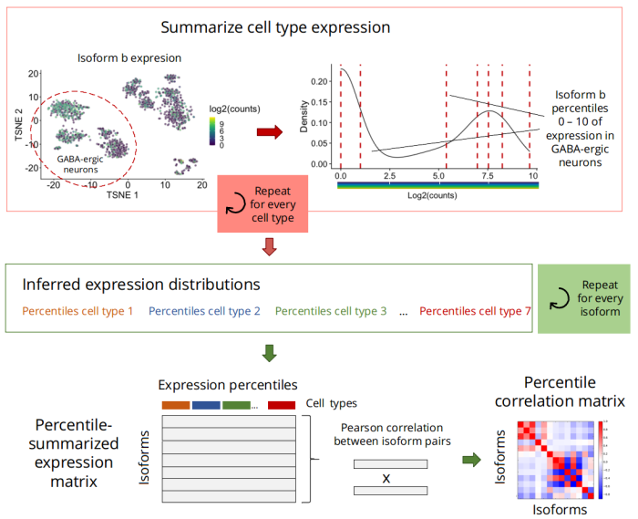
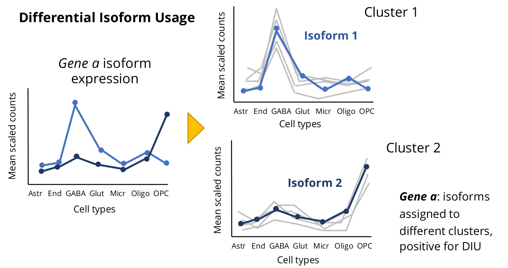
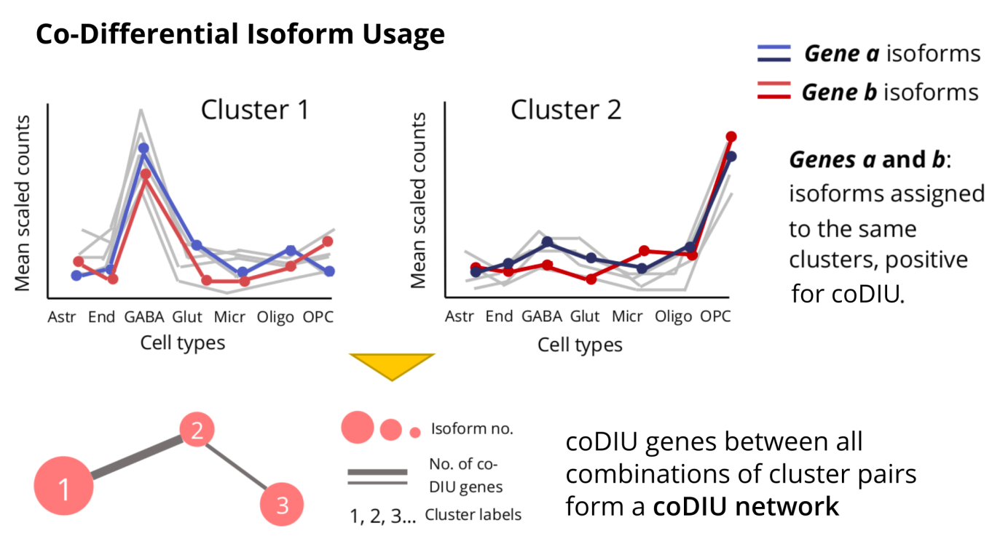

```{r, include = FALSE}
knitr::opts_chunk$set(
  collapse = TRUE,
  comment = "#>",
  dpi = 150, 
  out.width="100%",
  crop = NULL
)
```


# Introduction

The **acorde** R package contains the necessary functions to reproduce the
pipeline in [this paper](https://www.biorxiv.org/content/10.1101/2021.05.07.441841v1),
a study by *Arzalluz-Luque et al.* in which we analyze networks of isoform co-usage
using single-cell RNA-seq data (scRNA-seq).

The pipeline includes three basic analysis blocks:

1. **Single-cell isoform quantification and filtering**. First, bulk long read data is 
used to generate tissue-specific transcript models. Short-read scRNA-seq data
is then used for isoform quantification, and isoforms are filtered according to
their **Differential Expression** (DE) status across multiple cell types. 

2. **Detection of isoform co-expression**. *acorde* includes the implementation 
of percentile correlations, a novel strategy to obtain noise-robust correlation
estimates from scRNA-Seq data, and a semi-automated clustering approach to detect
modules of co-expressed isoforms acorss cell types.

3. **Differential and co-Differential Isoform Usage analysis**. DIU and co-DIU
analysis are designed to leverage the multiple cell types contained in single-cell
datasets, and enable the detection of genes that show isoform expression 
coordination. To couple these analysis with a biologically interpretable readout,
we incorporate functional annotations onto isoform models, and use 
[tappAS](https://github.com/ConesaLab/tappAS) for functional analysis.

Since both the long read-transcriptome definition procedure and the 
functional analyses in [[1]](#1) are based on external tools, the present R 
package does **not** incorporate neither of these two analysis steps. Instead,
acorde contains the necessary functions and documentation to obtain a set of 
DIU and co-DIU genes using an single-cell, isoform-level expression matrix as 
input.

In addition, we provide all the necessary instructions to reproduce the figures 
and additional analyses included in Arzalluz-Luque et al. [[1]](#1), 
and provide the isoform expression matrix employed during the study as internal 
data in the package.


# Installation

Acorde can be installed from GitHub using `devtools`:

```{r, eval = FALSE}
install.packages("devtools")
devtools::install_github("ConesaLab/acorde", build_vignettes = TRUE)

```


# Getting ready

To run the analyses in this vignette, you'll first need to load `acorde`:

```{r setup}
# load acorde
library(acorde)

# load auxiliary packages
suppressPackageStartupMessages({
  library(tibble)
  library(purrr)
  library(furrr)
  library(ggplot2)
  library(dplyr)
})
```

In addition, we'll require some additional packages for data 
handling and formatting. Most of them are signaled as `acorde` dependencies, 
so they will already be installed in your system.

To generate plots, we make use of the `cowplot` R package and the cowplot theme.
After install:

```{r, eval = FALSE}
install.packages("cowplot")
```

you can load and set the theme of your R session as follows:

```{r}
library(cowplot)
theme_set(theme_cowplot())
```


# Input data

The acorde pipeline requires a **single-cell isoform expression** matrix as input.
Single-cell isoform counts should be provided in the form of a `data.frame` or 
`tibble` object including isoforms as rows and cells as columns. Isoform identifiers
can be supplied as `rownames()` or as an additional identifier column, as required
by [tibble](https://tibble.tidyverse.org/articles/tibble.html).

To generate an isoform-level single-cell expression matrix, we first processed long 
read bulk data from ENCODE (provided by Wyman et al. [[2]](#2)) to build a mouse 
neural transcriptome, and then used publicly-available scRNA-seq data by Tasic 
et al. [[3]](#3) to quantify the expression of long read-defined isoforms in mouse 
neural cell types. Details to this process can be found in [our manuscript](https://www.biorxiv.org/content/10.1101/2021.05.07.441841v1) 
(see Supplementary Note and Methods).

If you wish to reproduce the analyses in Arzalluz-Luque et al. [[1]](#1)), you can load the
`tasic_down` object to use our isoform-quantified dataset:

```{r}
# load Tasic dataset
data("tasic_down")

# load Tasic metadata
data("metadata_down")
```

These contain two `tibble` objects. After downsampling and quality control
(see Methods in [Arzalluz-Luque et al.](https://doi.org/10.1101/2021.05.07.441841) 
[[1]](#1)), the `tasic_down` tibble contains expression data for **13452 isoforms** 
and **241 cells** belonging to 7 neural cell types:

```{r, echo = FALSE}
knitr::kable(metadata_down$cell_type %>% table %>% 
               enframe(name = "Cell type", value = "Number of cells"))
```

```{r}
# display format of tasic_down
tasic_down[1:6, 1:8]

# number of cells and isoforms
dim(tasic_down)

```

**Metadata** is contained in the `metadata_down` tibble. This table was generated 
using Tasic et al. supplementary files, which were used to parse cell type labels for 
single-cell IDs (i.e. sequencing run IDs, included in the `run` column), among 
other information:

```{r}
# show information contained in metadata_down
metadata_down %>% colnames

# display cell type labels and abundances
unique(metadata_down$cell_type)
```

See `?tasic_down` and `?metadata_down` for details.

# Isoform Differential Expression across multiple cell types

To select isoforms with robust co-variation across the 7 neural cell types, 
we first applied **multi-group Differential Expression analysis**, which will
detect isoforms that are differentially expressed (DE) in at least one cell type.

To achieve this, we combined the zero-weighting strategy in the [zinbwave](https://bioconductor.org/packages/release/bioc/vignettes/zinbwave/inst/doc/intro.html) 
R package with bulk-designed DE methods [DESeq2](https://bioconductor.org/packages/release/bioc/vignettes/DESeq2/inst/doc/DESeq2.html) 
and [edgeR](https://bioconductor.org/packages/release/bioc/vignettes/edgeR/inst/doc/edgeRUsersGuide.pdf).
Both tools were set to detect DE across multiple groups. The incorporation of 
weights to these analyses and the correct application of both tools to scRNA-seq 
data was done following the 
[Differential Expression section](https://bioconductor.org/packages/release/bioc/vignettes/zinbwave/inst/doc/intro.html#differential-expression) 
in the zinbwave vignette. 

Acorde provides the `cell_type_DE()` function, which constitutes a wrapper to 
these two methodologies. This function takes a `SingleCellExperiment` object
as input, and can run `DESeq2`, `edgeR` or both methods using the `mode` argument.

```{r, message = FALSE}
# convert tibble to count matrix
count.matrix <- column_to_rownames(tasic_down, "transcript_id") %>% 
  as.matrix
# round estimated counts from RSEM to generate integer values
count.matrix <- count.matrix %>% round

# create SingleCellExperiment object with Tasic data
library(SingleCellExperiment)

sce <- SingleCellExperiment(assays = list(counts = count.matrix, 
                                          logcounts = log2(count.matrix + 1)),
                            colData = metadata_down)
```

Applying `round()` can generate additional all-zero counts, in spite of the
previous zero count filtering of isoforms. If so, run an additional filtering
step to avoid errors during DE analysis:

```{r}
# filter isoforms with all-zero counts from SCE
sce <- sce[rowSums(counts(sce)) > 0,]
```

By default, `cell_type_DE()` automatically calculates and stores zinbwave weights in the
`weights` slot of the `SingleCellExperiment` object. Alternatively, you may set 
`cell_type_DE(compute_weights = FALSE)` and run `zinbwave()` yourself 
(note that computing weights is a computationally costly step, so we'll use 
the `BiocParallel` R package to parallelize the process):

```{r, eval = FALSE}
# load biocParallel
library(BiocParallel)

# compute weights
library(zinbwave)

sce <- zinbwave(sce, observationalWeights = TRUE, 
                BPPARAM = MulticoreParam(6))
```

Now we are ready to run isoform-level Differential Expression analysis. We'll
set `cell_type_DE(method = "both")` to be able to compare multi-group DE
results for both edgeR and DESeq2.

```{r, eval = FALSE}
# run DE analysis using both DESeq2 and edgeR
de_results <- cell_type_DE(sce, AdjPvalue = 0.05, 
                           mode = "both", 
                           compute_weights = FALSE)

# view DE results
de_results
```

Given that DE results may present subtle variations across method runs, 
we hereby provide the **DE result tables** that used in the acorde paper 
to fully ensure the reproducibility of our results. From here on out, 
this vignette will display the results of using this DE isoform set:

```{r}
# load isoform DE results for edgeR and DESeq2
data("de_results")
```

To obtain an overview of the number of isoforms that are DE in at least one cell type
reported by each of the methods, we can use the UpSetR package to calculate and
plot the intersection between the results stored in `de_results`:


```{r, message=FALSE, fig.width=9}
library(UpSetR)


de_isoforms <- list(edgeR = de_results$edgeR %>% 
                      select(transcript) %>% unlist,
                    DESeq2 = de_results$DESeq2 %>% 
                      select(transcript) %>% unlist)

upset(fromList(de_isoforms), nsets = 6, order.by = "freq", 
      sets.x.label = "DE isoforms \n(AdjP < 0.05)", text.scale = 1.5, 
      set_size.scale_max = 8000)
```

In our study, we preserved an isoform for downstream analysis if it was detected
as significantly DE by *at least one of the methods*, that is, 
we preserved the **union of DE results**. In addition, isoforms were removed if
they belonged to genes with a single DE isoform since, in practice, no 
differential splicing can occur for single-isoform genes (or for genes for which
only one isoform presents expression variation across cell types). Isoform - gene
correspondence is provided by acorde in the `gene_tr_ID` data object.

```{r}
# keep the union of edgeR and DESeq2 DE isoforms
tasic_de <- tasic_down %>% 
  filter(transcript_id %in% de_results$edgeR$transcript |
         transcript_id %in% de_results$DESeq2$transcript)

# load and display gene-isoform table
data("gene_tr_ID")
head(gene_tr_ID)

# remove transcripts from single-isoform genes
multi_iso <- split(tasic_de$transcript_id,
                  gene_tr_ID[match(tasic_de$transcript_id, gene_tr_ID$transcript_id),]$gene_id)
multi_iso <- multi_iso[map_int(multi_iso, length) > 1] %>% unlist

tasic_sp <- tasic_de %>%
  filter(transcript_id %in% multi_iso)
```

As a summary, here's a comparison of the number of isoforms remaining in our 
expression matrix after performing these filtering steps:

```{r, echo = FALSE}
knitr::kable(tibble(Object = c("tasic_down", "tasic_de", "tasic_sp"), 
                    Content = c("All isoforms", "DE isoforms", 
                            "DE isoforms from multi-isoform genes"),
                    Isoform_no = c(nrow(tasic_down), nrow(tasic_de),
                                  nrow(tasic_sp))))
```


# Computing isoform co-expression using percentile correlations

To detect isoform co-expression across the 7 neural cell types in the Tasic
dataset, we will apply **percentile correlations**. Percentile correlations,
as described in [[1]](#1)), are a metric designed to overcome cell-to-cell
effects that generate noise and mask the co-expression signal in the data,
yielding low correlation values when using traditional correlation metrics.

Instead, percentile correlations are based on a percentile-summarization strategy 
in which cells of the same cell-type are used to estimate a cell type-specific 
expression distribution for each isoform and 
**cell-level counts are replaced by percentile values**. 
Then, Pearson correlations between isoforms are computed using this
percentile-summarized expression. More details can be found in 
[Arzalluz-Luque et al.](https://doi.org/10.1101/2021.05.07.441841) [[1]](#1)) 
and in the figure below:


Acorde includes the `percentile_cor()` function to compute percentile correlations, 
which takes a cell - cell-type correspondence table and the expression matrix as
input, and generates an isoform-to-isoform correlation matrix:

```{r}
# create tibble matching cell IDs to cell-type labels
id.df <- select(metadata_down, run, cell_type)
id.df <- dplyr::rename(id.df, cell = "run")

# compute percentile correlations
cors <- percentile_cor(tasic_sp, id_table = id.df, percentile_no = 10, 
                       isoform_col = "transcript_id")

cors[1:4, 1:4]
```

By default, `percentile_cor()` summarizes isoform expression into 10 percentile 
values (deciles) per cell type, although users may supply any number between 4 
(quantiles) and 100 (percentiles). If a tibble is supplied, users will need to
specify the column name in which isoform identifiers are provided in order for
`percentile_cor()` to successfully return isoform IDs as column and row names
in the correlation matrix.


# Semi-supervised isoform clustering

The correlation matrix generated by `percentile_cor()` can be used to detect
groups of isoforms with similar expression patterns across and within cell
types, given that percentile correlation captures not only the similarities in expression 
patterns among the cell types, but also the agreement in expression "behaviour" 
of the isoforms in each of the cell types. 

Acorde includes a series of functions for clustering and cluster refinement that, 
when combined, provide a flexible framework to obtain modules of co-expressed 
isoforms. Initial clustering is based on the `cutreeHybrid()` function from the
[dynamicTreeCut](https://horvath.genetics.ucla.edu/html/CoexpressionNetwork/BranchCutting/) 
package. **dynamicTreeCut** is a hierarchical clustering algorithm based on the  
selection of optimal cut heights for different branches of the dendrogram, 
instead of applying the same fixed threshold to separate elements into clusters.

## Initial dynamic clustering with `cluster_isoforms()`

We will first run the `cluster_isoforms()` wrapper function, which takes a 
correlation matrix, generates the necessary inptus and runs `cutreeHybrid` under 
the hood:

```{r}
clusters <- cluster_isoforms(cors, deepSplit = 4, pamStage = FALSE, 
                             minClusterSize = 20)

# show number of clusters
length(clusters)
```

Briefly, `deepSplit` ranges between 0 and 4, and provides smaller, more accurate 
clusters when set to high values. Setting `pamStage = FALSE` allows return of 
unassigned items, which are placed on the first element of the `clusters` list. 
Finally, `minClusterSize` determines the minimum size of the produced clusters. 

In our study, we set these parameters in order to maximize 
the similarity between isoforms assigned to the same cluster, regardless of the 
high number of clusters obtained. This configuration was selected because acorde 
includes a series of steps in the pipeline to **refine and merge** some of these
clusters. These are designed to improve the expression signal while minimizing 
redundancies in the expression profile that they represent. However, if users 
want to run clustering using their own parameter setup, `cluster_isoforms()` 
can pass any additional parameters supplied to `cutreeHybrid()`.

In spite of being more flexible than regular hierarchical clustering, the
dynamicTreeCut algorithm can also generate inconsistent isoform assignments
to clusters, i.e. group isoforms with rather different expression profiles.

We'll now use two of the **cluster visualization** functions in acorde to 
view *cluster 1* in `clusters` (`clusters[[2]]`, given that the first element
of the list corresponds to unclustered isoforms) as an example of this. Acorde
provides a function, `calculate_cluster_ctmeans()`, to compute the mean and
standard error of cell type expression for each of the isoforms in a cluster.
In this manner, the similarities of the expression profiles across cell types
can be easily compared for same-cluster isoforms. The output of 
`calculate_cluster_ctmeans` can be directly provided to `plot_cluster_ctmeans()`
to generate a visual summary of all isoforms in a cluster:

```{r, fig.small=TRUE}
# scale isoform expression
tasic_scaled <- scale_range(tasic_sp, isoform_col = "transcript_id")

# calculate cell type mean expression for all isoforms
example_means <- calculate_cluster_ctmeans(tasic_scaled,
                                           isoform_ids = clusters[[2]], 
                                           id_table = id.df)

# plot isoform-level means for all isoforms in the cluster
ctlabs <- c("Astr", "End", "GABA", "Glut", "Micro", "Oligo", "OPC")

plot_cluster_ctmeans(example_means, ct_labels = ctlabs)
```

## Cluster filtering with `filter_clusters()`

Arguably, some of the isoforms in *cluster 1* have an expression pattern that is 
slightly different to the rest of the members of the cluster. To solve this, we 
can use the `filter_clusters()` function, which will move isoforms to the unclustered groups 
if they are poorly correlated with most of the isoforms in the cluster.

```{r}
# see current number of unclustered isoforms
clusters[[1]] %>% length

# run filter_clusters
clusters_filt <- filter_clusters(clusters, cor_matrix = cors,
                                 contains_unclustered = TRUE,
                                 min_cor = 0.85, lowcor_threshold = 3,
                                 size_filter = TRUE, size_threshold = 10)

# see number of unclustered isoforms after filtering
clusters_filt[[1]] %>% length

# number of isoforms remaining in clusters
clusters_filt[2:length(clusters_filt)] %>% map_int(length) %>% sum
```

In this step, isoforms will be removed from a cluster if they have correlation 
values below `min_cor` with other members of the cluster. `lowcor_threshold`
provides the maximum number of correlation values lower than `min_cor` that
are allowed per isoform. In addition, `size_filter` and `size_threshold` can be
used to discard clusters by their size, moving isoforms in clusters that are too
small to the unclustered group.

As a result, half of the isoforms that were initially input for clustering
are currently not assigned, and we have successfully cleaned the signal of our 
initial set of clusters. *cluster 1* now looks like this:

```{r, fig.small=TRUE}
# calculate cell type mean expression for all isoforms
example_means.filt <- calculate_cluster_ctmeans(tasic_scaled,
                                           isoform_ids = clusters_filt[[2]], 
                                           id_table = id.df)

# plot isoform-level means for all isoforms in the cluster
plot_cluster_ctmeans(example_means.filt, ct_labels = ctlabs)
```

## Assigning unclustered isoforms to clusters with `expand_clusters()`

Next, we will use the `expand_clusters()` function in acorde to join unclustered 
isoforms to their most similar cluster. In this process, each cluster's profile
is first summarized into a synthetic representative transcript that we named
*metatranscript*. Metatranscripts are calculated as the mean of the percentile-summarized
expression of all isoforms in the cluster. Then, the function computes percentile 
correlations between isoforms and cluster metatranscripts.

In our study, we performed **two rounds of assignment** (i.e. expansion). First, 
we assigned unclustered isoforms to a cluster if they showed correlation > 0.9 
with its metatranscript (amnd the maximally correlated cluster was selected as the best match 
if there were ties). Next, metatranscripts were re-calculated for the newly 
expanded clusters, and we performed another assignment round lowering the 
correlation threshold to 0.8.

By making this a two-step process, highly correlated 
elements will contribute to strengthen within-cluster signal before assigning 
more lowly correlated isoforms to the cluster:

```{r, message=FALSE}
# first round, expand using hard correlation threshold
clusters_expanded <- expand_clusters(tasic_sp, isoform_col = "transcript_id", 
                                     id_table = id.df,
                                     cluster_list = clusters_filt[2:length(clusters_filt)],
                                     unclustered = clusters_filt[[1]],
                                     force_expand = FALSE, 
                                     expand_threshold = 0.9,
                                     method = "percentile")

# show output format
names(clusters_expanded)
map_chr(clusters_expanded, class)
map_int(clusters_expanded, length)

# check number of unclustered isoforms after first round
length(clusters_expanded$unclustered)


# second round, soft threshold for the rest of the unclustered isoforms
clusters_expanded <- expand_clusters(tasic_sp, isoform_col = "transcript_id",
                                     id_table = id.df,
                                     cluster_list = clusters_expanded$expanded,
                                     unclustered = clusters_expanded$unclustered,
                                     force_expand = FALSE, 
                                     expand_threshold = 0.8,
                                     method = "percentile")

# check number of unclustered isoforms after second round
length(clusters_expanded$unclustered)
```

The correlation threshold used to assign an isoform to a cluster can be adjusted 
via the `expand_threshold` parameter. To simplify, users may set `force_expand = TRUE` 
to assign isoforms to the cluster reporting the highest correlation. In this case, 
`expand_threshold` will be ignored. 

We can now check the effect of cluster expansion on our example cluster, *cluster 1*.
Note that after expansion, unclustered isoforms are now assigned to the `unclustered` 
list element, while the list containing the clusters is situated in the `expanded`
slot. Therefore, *cluster 1* is now `clusters_expanded$expanded[[1]]`:

```{r, fig.small=TRUE}
# compare cluster sizes
  # before expansion
  clusters_filt[[2]] %>% length

  # after expansion
  example_expanded <- clusters_expanded$expanded[[1]]
  example_expanded %>% length


# calculate cell type mean expression for all isoforms in cluster
example_means.exp <- calculate_cluster_ctmeans(tasic_scaled,
                                           isoform_ids = example_expanded, 
                                           id_table = id.df)

# plot isoform-level means for all isoforms in the cluster
plot_cluster_ctmeans(example_means.exp, ct_labels = ctlabs)
```

## Eliminating redundancies across cluster profiles with `merge_clusters()`

At this point, we have focused on the reduction of within-cluster variability,
which results in a large number of small, redundant clusters. To mitigate this,
acorde includes the `merge_clusters()` function, which detects expression profile similarities 
across clusters (redundancy) and merges them into a single cluster. Briefly, `merge_clusters`
employs a clustering approach using the metatranscripts for computed clusters
as input, which is done via regular hierarchical clustering (by default) or using
the dynamic approach implemented in the `cutreeHybrid()` function from the
dynamicTreeCut package (when `dynamic = TRUE` is set).

For our study, we run dynamic clustering of metatranscripts, providing 
`deepSplit = 4, pamStage = FALSE, minClusterSize = 1` as non-default parameters
for `merge_clusters` to pass on to `cutreeHybrid`:

```{r, message=FALSE}
merge.output <- merge_clusters(tasic_sp, isoform_col = "transcript_id",
                               id_table = id.df,
                               cluster_list = clusters_expanded$expanded, 
                               dynamic = TRUE,
                               deepSplit = 4, pamStage = FALSE,
                               minClusterSize = 1,
                               method = "percentile")
```

`merge_clusters()` returns a nested list including two elements:
first, a list containing the merged cluster indices, allowing traceback of all
merged decisions; and second, a list containing the merged clusters obtained
as a result.


```{r}
# show output format
map_chr(merge.output, class)
map_int(merge.output, length)

# retrieve outputs
merged_groups <- merge.output[[1]]
clusters_merged <- merge.output[[2]]

# show merge decision tree
head(merged_groups)

# show merged cluster formats
map(head(clusters_merged), head, 5)
```

After dynamic merge, the 147 clusters that were left after expansion have been 
reduced to 55 clusters. We can now check the results of any of the cluster merge 
decisions made by `merge_clusters` (which, after specifying `dynamic = TRUE` runs
`cutreeHybrid` under the hood) to verify that they are correct. Let's take, for
instance, `merged cluster 4`:

```{r, fig.height=7, fig.width=9}
# plot an example of clusters that have been merged together
example_group <- merged_groups[[4]]

example_group

# compute cell type mean expression for merged clusters
merge_check <- clusters_expanded$expanded[example_group] %>% 
  map(~calculate_cluster_ctmeans(tasic_scaled,
                                 isoform_ids = .,
                                 id_table = id.df))

# create plots and plot grid
merge_check_plots <- seq(1, length(merge_check)) %>% 
  map(~plot_cluster_ctmeans(merge_check[[.]], 
                            plot_title = paste("Cluster", example_group[.]), 
                            ct_labels = ctlabs))

plot_grid(plotlist = merge_check_plots)
```


# Optional: manual curation of redundant and/or noisy clusters

As shown above, dynamic clustering of metatranscripts generally works well for 
removing redundancies. However, there are some situations where a fully-automated 
merge does not perform as expected, and we may want more control over the results. 
We will next demonstrate the manual curation of **redundancy**, i.e. 
exceptions where clearly similar profiles were not merged by clustering 
metatranscripts, and **noisy profiles**, i.e. cases where automated merging 
resuled in joining clusters with clearly uncorrelated profiles.


## Clusters with noisy profiles

To detect clusters with noisy or inaccurate profiles, that is, clusters including
isoforms that have very different expression behaviour across cell types, we first
need to visualize all generated clusters. 

Up to this point, acorde has generated 60 total isoform clusters. To enable a more
summarized and elegant view of cluster profiles than that generated by 
`plot_cluster_ctmeans()`, acorde also includes a two functions, 
`calculate_cluster_profile()` and `plot_cluster_profile()`, that compute and plot 
the mean and standard deviation of cell type-summarized expression for clustered 
isoforms, creating a fully summarized view of the cluster:

```{r, fig.width=12, fig.height=10}
# calculate cluster summarized profiles
merged_profiles <- map(clusters_merged, 
                       ~calculate_cluster_profile(tasic_scaled,
                                                  id_table = id.df,
                                                  isoform_ids = .))

# create all pattern plots
merged_plots <- map(merged_profiles,
                    ~plot_cluster_profile(., ct_labels = ctlabs))

# view a subset of the plots
plot_grid(plotlist = merged_plots[1:16], ncol = 4, 
          labels = seq(1, 16))

```

Among the 60 clusters generated as a result of unsupervised clustering, there are
a few that show strong variability in comparison to the global cluster mean, given
the broad standard deviation ribbon in some of the plots (take for instance
clusters 2, 3 or 5). 

To mitigate this, we decided to use the `expand_clusters()` function with a correlation
threshold of 0.8 to re-assign isoforms in clusters that had a visibly inaccurate
(i.e. noisy) profile:

```{r, message=FALSE}
# select noisy clusters by number
noisy <- c(2, 3, 5, 11, 17, 19, 21, 24, 25, 26, 
           32, 36, 38, 43, 48, 52, 58, 59)

# use expand_clusters() to re-assign
clusters_merged.exp <- expand_clusters(tasic_sp, isoform_col = "transcript_id",
                                       id_table = id.df, 
                                       cluster_list = clusters_merged[-noisy],
                                       unclustered = unlist(clusters_merged[noisy]), 
                                       force_expand = FALSE,
                                       expand_threshold = 0.8,
                                       method = "percentile")

# show contents
map_int(clusters_merged.exp, length)

```

Now, there are additional unclustered transcripts in `clusters_merged.exp$unlcustered`. 
We will join these with the isoforms that remained unclustered after our previous 
two rounds of cluster expansion, and get the total number of isoforms that have not
been clustered by our pipeline:

```{r}
# group unclustered isoforms
unclustered <- c(clusters_expanded$unclustered, 
                 clusters_merged.exp$unclustered)

# show total number of unclustered
length(unclustered)

# remove unclustered from current cluster list
clusters_merged.exp <- clusters_merged.exp$expanded

# show current number of clusters
length(clusters_merged.exp)
```

Removing noisy clusters and assigning their isoforms to other groups leaves 
**42 clusters** that can now be evaluated for potential redundancies. 


## Clusters with redundant profiles
After merging clusters by dynamic hierarchical clustering, we would expect
each of the output clusters to represent a unique expression profile across cell
types. However, our parameter choice for cluster merge was rather lenient, meaning
that it was made to sacrifice some potentially correct merge decisions in order to avoid
others that may result in highly dissimilar clusters being merged.
For this reason, there may still be some cluster profiles that remain highly similar. 

To detect redundancies among the **42 clusters** that we have currently generated,
we can use the `*_cluster_profile()` visualization functions to inspect them:

```{r, fig.width=12, fig.height=10}
# calculate profiles of previously re-expanded
rexp_profiles <- map(clusters_merged.exp,
                     ~calculate_cluster_profile(tasic_scaled,
                                                id_table = id.df,
                                                isoform_ids = .))

# create plots for the 42 clusters
rexp_plots <- map(rexp_profiles, 
                  ~plot_cluster_profile(., ct_labels = ctlabs))

# create a grid with some of the plots as an example
plot_grid(plotlist = rexp_plots[1:16], ncol = 4, 
          labels = seq(1, 16))
```

Within the subset of clusters above, it is easy to detect some redundant clusters.
For instance, *cluster 2* and *cluster 4* are clearly including isoforms with the
same expression pattern across the 7 cell types in the Tasic dataset.

To remove redundancies, we grouped visibly reduntant clusters and generated a
new cluster list:

```{r}
# create list of merge decisions
curation_list <- list(c(2,4,34), c(7,10,19), c(6,21,23,32,29), c(31,38), c(26,28),
                    c(1,35), c(36,22), c(9,11), c(13,15,40), c(27,16), c(24,42),
                    c(8,20,39), c(5,30), c(12,14,17,33))
```

In total, we generated **14 cluster groups**. We next grouped the isoforms
included in each of them, and generated a curated cluster list:

```{r}
# create curated cluster list by merging redundant clusters
clusters_final <- c(clusters_merged.exp[-unlist(curation_list)],
                         map(curation_list, ~unlist(clusters_merged.exp[.])))

# show final number of clusters
length(clusters_final)

# set correct cluster names
names(clusters_final) <- as.character(seq(1, length(clusters_final)))
```

Now, we can **plot the final clusters** using the visualization functions 
in acorde to make sure that they represent unique, accurate profiles:

```{r, fig.width=12, fig.height=10}
# calculate profile and create plots
final_profiles <- map(clusters_final, 
                      ~calculate_cluster_profile(tasic_scaled,
                                                 id_table = id.df,
                                                 isoform_ids = .))

final_plots <- map(final_profiles,
                   ~plot_cluster_profile(., ct_labels = ctlabs))

# create grid
plot_grid(plotlist = final_plots,
          labels = seq(1, length(final_plots)))
```

# Optional: handle isoforms that remain unclustered

For users who wish to assign isoforms for which no cluster matches could
be found (i.e. unclustered isoforms), the following strategy may be used.
Briefly, we can use the `force_expand = TRUE` argument in the `expand_clusters()`
function to assign isoforms to clusters using the maximum correlation with the
cluster's metatranscript:

```{r, message=FALSE}
# run expand_clusters, with force_expand = TRUE
clusters_final.exp <- expand_clusters(tasic_sp, 
                                      isoform_col = "transcript_id", 
                                      id_table = id.df,
                                      cluster_list = clusters_final,
                                      unclustered = unclustered,
                                      force_expand = TRUE,
                                      method = "percentile")

```


# Keep isoforms from genes with Differential Isoform Usage (DIU)

As a result of clustering, we can next evaluate whether genes that have clustered
isoforms are positive for **Differential Isoform Usage** (DIU). DIU genes must have
more than one clustered isoform, and at least two of these isoforms assigned
to different clusters. Differential cluster assignment indicates different isoform
usage in at least one cell type, and is therefore a straightforward way to call
DIU when multiple cell groups are considered.



To detect DIU genes, isoforms must be removed from clusters in the following
cases: **1)** if these isoforms belong to genes that have a single isoform assigned 
to clusters and **2)** if they belong to genes with two or more clustered isoforms
that have no same-gene counterparts in any of the other clusters. Both filters
can be applied running the `keep_DIU()` function in acorde:

```{r}
# remove isoforms from non-DIU genes
clusters_diu <- keep_DIU(clusters_final.exp, gene_tr_table = gene_tr_ID)
```

To obtain a list of all DIU genes that have isoforms in our clusters, we simply
need to use the `gene_tr_ID` table to translate transcript to gene IDs:

```{r}
# obtain gene ID-based clusters
clusters_diu.gene <- map(clusters_diu, 
                          ~gene_tr_ID[match(., 
                                            gene_tr_ID$transcript_id),]$gene_id)

# obtain list of DIU genes
diu_genes <- unlist(clusters_diu.gene) %>% unique

# total number of DIU genes:
length(diu_genes)
```

In summary, we currently have clustered **7575 isoforms** into 
**19 expression patterns** across the 7 cell types in the Tasic dataset, and 
these isoforms belong to **2577 DIU genes**.


# Detection of genes with co-Differential Isoform Usage (coDIU)

We define co-Differential Isoform Usage (coDIU) as an isoform expression pattern
in which a group of genes shows co-expression of their isoforms, but no 
co-expression is detected when considering only gene-level expression. A coDIU
situation between a pair of genes, *gene a* and *gene b*, is represented below:



First, we recommend adjusting some global parmeters to allow heavy computation
to take place (note that the exact value may depend on your system requirements):

```{r, eval=FALSE}
options(future.globals.maxSize = 768 * 1024^2)
```


Then, we will use the `find_shared_genes()` function in acorde to generate a list
of potentially coDIU gene pairs, that is, genes that have at least two of their
isoforms assigned to the same clusters, therefore showing isoform-level 
co-expression across cell types. We often refer to these as "shared genes", given
that they share isoforms across two or more clusters:

```{r, eval=FALSE}
# find shared gene pairs
shared_pairs <- find_shared_genes(clusters_diu, gene_tr_table = gene_tr_ID)

# show dimensions of results
dim(shared_pairs)
```

However, clustering can allow expression pattern variability among cluster
members, and sometimes isoforms in a cluster might not exactly reflect their 
expression pattern. Especially when coDIU is detected between two clusters
reflecting a closely-related pattern (for instance, similar expression except for
one cell type), there may be some false-positives coDIU genes among those detected
by `find_shared_genes()`.

To control for this, acorde provides a statistical test for each potentially 
coDIU gene pair, i.e. gene 1 and gene 2, for which isoforms were detected in two
clusters, i.e. cluster 1 and cluster 2. We here test two different conditions for coDIU: 
**a)** that the average profile across cell types of the two isoforms in cluster 
1 is significantly different to the average profile of the two isoforms in
cluster 2; and **b)** that the average profile of the two isoforms of gene 1
is *not* different to the average profile of the two isoforms of gene 2. 

For each pair of genes, the test will return two p-values, each corresponding 
to one of the above-described questions:

- *cluster:cell_type*: should be significant if **condition a** is fulfilled.
- *gene:cell_type*: should **NOT** be significant if **condition b** is 
satisifed.


The test is implemented in the `test_shared_genes()` function, and can be run
as follows:

```{r, eval=FALSE}
# test shared gene pairs
pvalues <- test_shared_genes(tasic_sp, 
                             cluster_list = clusters_diu, 
                             shared_genes = shared_pairs, 
                             gene_tr_table = gene_tr_ID, 
                             id_table = id.df)

# remove gene pairs that could not be tested (returns NA)
test_success <- map_lgl(pvalues, is_tibble)
shared_pairs <- shared_pairs[,test_success]

# format ouptut after removing failed tests
pvalue.df <- pvalues[test_success] %>% bind_rows

# adjust the two sets of p-values
pvalue.df$`cluster:cell_type` <- p.adjust(pvalue.df$`cluster:cell_type`, 
                                          method = "BH")
pvalue.df$`gene:cell_type` <- p.adjust(pvalue.df$`gene:cell_type`, 
                                       method = "BH")
```

Now, we can filter the `shared_pairs` matrix to only keep genes that satisfy the
two conditions for coDIU when tested with at least one other gene:

```{r, eval=FALSE}
# filter shared gene list to only keep significant interactions
sig_pairs <- shared_pairs[,pvalue.df$`cluster:cell_type` < 0.05 &
                              pvalue.df$`gene:cell_type` > 0.05]
sig_all <- sig_pairs %>% as.character %>% unique
```

Finally, using the gene IDs in `sig_all`, we can now filter the clusters to only 
include isoforms from significantly coDIU genes:

```{r, eval=FALSE}
# filter cluster lists
clusters_diu.gene.sig <- map(clusters_coDS.gene, 
                              enframe, name = NULL, value = "gene") %>%
  map(~filter(., gene %in% sig_all))

clusters_diu.sig <- map2(map(clusters_coDS.gene, 
                              enframe, name = NULL, value = "gene"),
                          map(clusters_coDS, enframe, name = NULL, value = "transcript"),
                                 ~mutate(.y, gene = .x$gene)) %>%
          map(~filter(., gene %in% sig_all) %>% select(transcript))
```


# Conclusion

The final output of the acorde pipeline consists in:

- **Isoform clusters** representing unique expression patterns across cell types.
- A list of identifiers of both **DIU** and **coDIU genes**, which can then be
used for functional characterization.

More information about DIU and coDIU gene characterization and the type of 
functional insights that can be obtained from the acorde output can be found
in [Arzalluz-Luque et al.](https://www.biorxiv.org/content/10.1101/2021.05.07.441841v1).


# References

If you use **acorde** in your research, please cite:

- <a id="1">[1]</a>
Angeles Arzalluz-Luque, Pedro Salguero, Sonia Tarazona, Ana Conesa:
*Acorde*: unraveling functionally-interpretable networks of isoform co-usage 
from single cell data. *bioRxiv* 2021.05.07.441841 (2021); 
doi: https://doi.org/10.1101/2021.05.07.441841


Long-read data was obtained from the [ENCODE consortium](http://encodeproject.org/),
and made publicly available by Wyman et al. in their bioRxiv preprint:

- <a id="2">[2]</a>
Dana Wyman, Gabriela Balderrama-Gutierrez, Fairlie Reese, 
Shan Jiang, Sorena Rahmanian, Weihua Zeng, Brian Williams, Diane Trout, Whitney 
England, Sophie Chu, Robert C. Spitale, Andrea Tenner, Barbara Wold, Ali Mortazavi:
A technology-agnostic long-read analysis pipeline for transcriptome discovery 
and quantification. *bioRxiv* 672931 (2020); doi: https://doi.org/10.1101/672931 

Short-read scRNA-seq data was obtained from Tasic et al. (2016): 

- <a id="3">[3]</a>
Tasic, B. et al. Adult mouse cortical cell taxonomy revealed by single cell 
transcriptomics. *Nature Neuroscience*. 19, 335–346 (2016).
