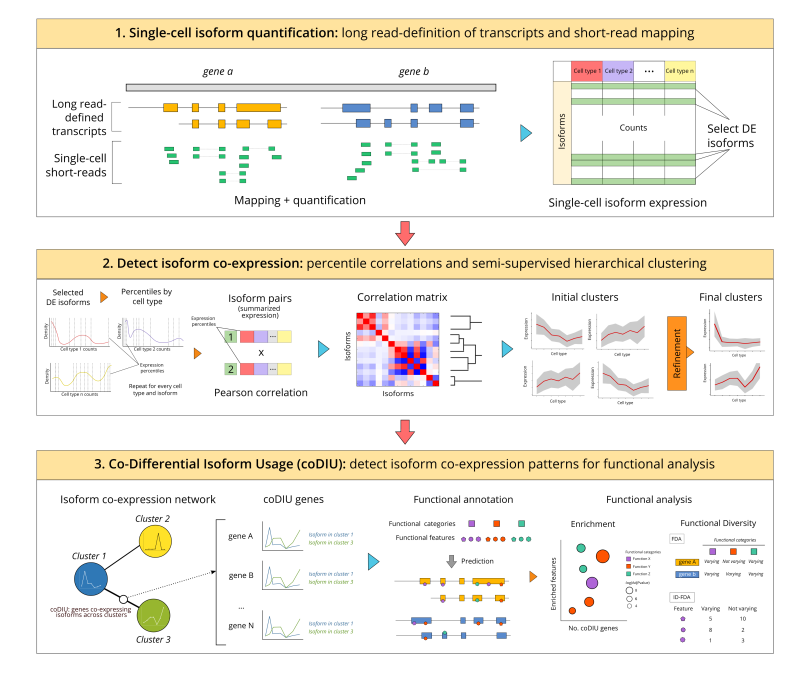

```{r, include = FALSE}
knitr::opts_chunk$set(
  collapse = TRUE,
  comment = "#>",
  dpi = 150, 
  out.width="100%",
  crop = NULL
)
```


# Introduction

The **acorde** R package contains the necessary functions to reproduce the
pipeline in [this paper](https://www.biorxiv.org/content/10.1101/2021.05.07.441841v1),
a study by *Arzalluz-Luque et al.* in which we analyze networks of isoform co-usage
using single-cell RNA-seq data (scRNA-seq).

The pipeline includes three basic analysis blocks:

1. **Single-cell isoform quantification and filtering**. First, bulk long read data is 
used to generate tissue-specific transcript models. Short-read scRNA-seq data
is then used for isoform quantification, and isoforms are filtered according to
their **Differential Expression** (DE) status across multiple cell types. 

2. **Detection of isoform co-expression**. *acorde* includes the implementation 
of percentile correlations, a novel strategy to obtain noise-robust correlation
estimates from scRNA-Seq data, and a semi-automated clustering approach to detect
modules of co-expressed isoforms acorss cell types.

3. **Differential and co-Differential Isoform Usage analysis**. DIU and co-DIU
analysis are designed to leverage the multiple cell types contained in single-cell
datasets, and enable the detection of genes that show isoform expression 
coordination. To couple these analysis with a biologically interpretable readout,
we incorporate functional annotations onto isoform models, and use 
[tappAS](https://github.com/ConesaLab/tappAS) for functional analysis.

Since both the long read-transcriptome definition procedure and the 
functional analyses in [[1]](#1) are based on external tools, the present R 
package does **not** incorporate neither of these two analysis steps. Instead,
acorde contains the necessary functions and documentation to obtain a set of 
DIU and co-DIU genes using an single-cell, isoform-level expression matrix as 
input.

In addition, we provide all the necessary instructions to reproduce the figures 
and additional analyses included in Arzalluz-Luque et al. [[1]](#1), 
and provide the isoform expression matrix employed during the study as internal 
data in the package.



# Installation

Acorde can be installed from GitHub using `devtools`:

```{r, eval = FALSE}
install.packages("devtools")
devtools::install_github("ConesaLab/acorde", build_vignettes = TRUE)

```


# Getting ready

To run the analyses in this vignette, you'll first need to load `acorde`:

```{r setup, results = "hide"}
# load acorde
library(acorde)

# load auxiliary packages
suppressPackageStartupMessages({
  library(dplyr)
  library(tibble)
  library(purrr)
  library(furrr)
  library(ggplot2)
  library(SingleCellExperiment)
})
```

In addition, we'll require some additional packages for data 
handling and formatting. Most of them are signaled as `acorde` dependencies, 
so they will already be installed in your system.

To generate plots, we make use of the `cowplot` R package and the cowplot theme.
After install:

```{r, eval = FALSE}
install.packages("cowplot")
```

...you can load and set the theme of your R session as follows:

```{r}
library(cowplot)
theme_set(theme_cowplot())
```


# Input data

The acorde pipeline requires a **single-cell isoform expression** matrix as input.
Single-cell isoform counts should be provided in the form of a `data.frame` or 
`tibble` object including isoforms as rows and cells as columns. Isoform identifiers
can be supplied as `rownames()` or as an additional identifier column, as required
by [tibble](https://tibble.tidyverse.org/articles/tibble.html).

To generate an isoform-level single-cell expression matrix, we first processed long 
read bulk data from ENCODE (provided by Wyman et al. [[2]](#2)) to build a mouse 
neural transcriptome, and then used publicly-available scRNA-seq data by Tasic 
et al. [[3]](#3) to quantify the expression of long read-defined isoforms in mouse 
neural cell types. Details to this process can be found in [our manuscript](https://www.biorxiv.org/content/10.1101/2021.05.07.441841v1) 
(see Supplementary Note and Methods).

If you wish to reproduce the analyses in Arzalluz-Luque et al. [[1]](#1)), you can load the
`tasic` object to use our isoform-quantified dataset:

```{r}
# load Tasic dataset
data("tasic")

# load Tasic metadata
data("metadata")

# use metadata to create a cell - cell type identity table
id_table <- metadata %>%
    select(run, cell_type) %>%
    dplyr::rename(cell = "run")
```

These contain two `tibble` objects. After quality control
(see Methods in [Arzalluz-Luque et al.](https://doi.org/10.1101/2021.05.07.441841) 
[[1]](#1)), the `tasic` tibble contains expression data for **16240 isoforms** 
and **1591 cells** belonging to 7 neural cell types:

```{r, echo = FALSE}
knitr::kable(metadata$cell_type %>% table %>% 
               enframe(name = "Cell type", value = "Number of cells"))
```

```{r}
# display format of tasic
tasic[1:6, 1:8]

# number of cells and isoforms
dim(tasic)

```

**Metadata** is contained in the `metadata` tibble. This table was generated 
using Tasic et al. supplementary files, which were used to parse cell type labels for 
single-cell IDs (i.e. sequencing run IDs, included in the `run` column), among 
other information:

```{r}
# show information contained in metadata
metadata %>% colnames

# display cell type labels
unique(metadata$cell_type)
```

See `?tasic` and `?metadata` for details.

# Isoform Differential Expression across multiple cell types

To select isoforms with robust co-variation across the 7 neural cell types, 
we first applied **multi-group Differential Expression analysis**, which will
detect isoforms that are differentially expressed (DE) in at least one cell type.

To achieve this, we combined the zero-weighting strategy in the [zinbwave](https://bioconductor.org/packages/release/bioc/vignettes/zinbwave/inst/doc/intro.html) 
R package with bulk-designed DE methods [DESeq2](https://bioconductor.org/packages/release/bioc/vignettes/DESeq2/inst/doc/DESeq2.html) 
and [edgeR](https://bioconductor.org/packages/release/bioc/vignettes/edgeR/inst/doc/edgeRUsersGuide.pdf).
Both tools were set to detect DE across multiple groups. The incorporation of 
weights to these analyses and the correct application of both tools to scRNA-seq 
data was done following the 
[Differential Expression section](https://bioconductor.org/packages/release/bioc/vignettes/zinbwave/inst/doc/intro.html#differential-expression) 
in the zinbwave vignette. 

Acorde provides the `cell_type_DE()` function, which constitutes a wrapper to 
these two methodologies. This function takes a `SingleCellExperiment` object
as input:

```{r, message = FALSE}
# convert tibble to count matrix
count.matrix <- column_to_rownames(tasic, "transcript") %>% 
  as.matrix
# round estimated counts from RSEM to generate integer values
count.matrix <- count.matrix %>% round

# create SingleCellExperiment object with Tasic data
sce <- SingleCellExperiment(assays = list(counts = count.matrix, 
                                          logcounts = log2(count.matrix + 1)),
                            colData = metadata)
```

By default, `cell_type_DE()` automatically calculates and stores zinbwave weights in the
`weights` slot of the `SingleCellExperiment` object. Alternatively, you may set 
`cell_type_DE(compute_weights = FALSE)` and run `zinbwave()` yourself 
(note that computing weights is a computationally costly step, so we'll use 
the `BiocParallel` R package to parallelize the process):

```{r, eval = FALSE}
# load biocParallel
library(BiocParallel)

# compute weights
library(zinbwave)

sce <- zinbwave(sce, observationalWeights = TRUE, 
                BPPARAM = MulticoreParam(6))
```

Now we are ready to run isoform-level Differential Expression analysis.
Set `cell_type_DE(method = "both")` to be able to compare multi-group DE
results for both edgeR and DESeq2, or choose either `"edgeR"` or `"DESeq2"`
to run just one DE analysis.

```{r, eval = FALSE}
# run DE analysis using both DESeq2 and edgeR
de_results <- cell_type_DE(sce, AdjPvalue = 0.05, 
                           mode = "both", 
                           compute_weights = FALSE)
```

In the acorde manuscript, a downsampling strategy was used to balance cell type
abundances between neural and glial cell types. Briefly, 50 runs of random sampling
were performed to select 45 GABA and 45 glutamatergic neuron cells, and both edgeR
and DESeq2 were run to obtain DE isoforms using each of the 50 downsampled versions
of the data. Next, isoforms detected to be significantly DE by *at least one of the methods* 
in >50% of the runs were considered to be DE. 

We hereby provide the **DE consensus set** that was used in the acorde paper 
to fully ensure the reproducibility of our results. From here on out, 
this vignette will display the results of using this DE isoform set:

```{r}
# load consensus set of DE isoforms
data("consensus_DE_set")

# filter expression matrix
tasic_de <- tasic %>%
  filter(transcript %in% consensus_DE_set$transcript)
```


## Other isoform filtering criteria

In addition to DE filtering, several functions are provided in acorde
to control for other expression-related biases and remove isoforms prior to 
downstream analysis (or during quality control):

* `detect_sparse()` flags isoforms that have high proportion of zeros in all
cell types. Isoforms must have non-zero expression in a proportion higher than
the supplied threshold in at least one cell type.
* `detect_minor_isoforms()` flags isoforms with low gene-relative expression 
across cell types. Isoforms that represent a small proportion of the total gene's 
expression will be flagged as minor.
* `detect_low_expression()` flags isoforms with low mean/median counts across 
cell types.

For our manuscript, we removed minor isoforms using a 10% gene-relative 
expression threshold:

```{r}
# detect minor isoforms
minor <- detect_minor_isoforms(tasic_de, id_table = id_table,
                               gene_tr_table = gene_tr_ID,
                               gene_expr_proportion = 0.1,
                               isoform_col = "transcript")

head(minor)

# summary of minor isoforms detected
table(minor$minor_isoform)

# get isoforms that were not flagged as minor
excl_minor <- filter(minor, minor_isoform == FALSE)

# apply filter
tasic_sp <- tasic_de %>% 
  filter(transcript %in% excl_minor$transcript)
```


Next, isoforms were removed if they belonged to genes with a single DE isoform 
since, in practice, no differential splicing can occur for single-isoform genes 
(or for genes for which only one isoform presents expression variation across 
cell types). Isoform - gene correspondence is provided by acorde in the `gene_tr_ID` 
data object.

```{r}
# load and display gene-isoform table
data("gene_tr_ID")
head(gene_tr_ID)

# remove transcripts from single-isoform genes
gspliced <- tasic_sp %>%
  select(transcript) %>%
  left_join(gene_tr_ID, by = "transcript") %>%
  group_by(gene) %>%
  filter(n() > 1)

tasic_sp <- tasic_sp %>%
  filter(transcript %in% gspliced$transcript)
```

As a summary, here's a comparison of the number of isoforms remaining in our 
expression matrix after performing these filtering steps:

```{r, echo = FALSE}
knitr::kable(tibble(Object = c("tasic", "tasic_de", "tasic_sp"), 
                    Content = c("All isoforms", "DE isoforms", 
                            "DE isoforms from multi-isoform genes"),
                    Isoform_no = c(nrow(tasic), nrow(tasic_de),
                                  nrow(tasic_sp))))
```


# Computing isoform co-expression using percentile correlations

To detect isoform co-expression across the 7 neural cell types in the Tasic
dataset, we will apply **percentile correlations**. Percentile correlations,
as described in [[1]](#1)), are a metric designed to overcome cell-to-cell
effects that generate noise and mask the co-expression signal in the data,
yielding low correlation values when using traditional correlation metrics.

Instead, percentile correlations are based on a percentile-summarizing strategy 
in which cells of the same cell-type are used to estimate a cell type-specific 
expression distribution for each isoform and 
**cell-level counts are replaced by percentile values**. 
Then, Pearson correlations between isoforms are computed using this
percentile-summarized expression. More details can be found in 
[Arzalluz-Luque et al.](https://doi.org/10.1101/2021.05.07.441841) [[1]](#1)) 
and in the figure below:


Acorde includes the `percentile_cor()` function to compute percentile correlations, 
which takes a cell - cell-type correspondence table (`id_table` defined above) 
and the expression matrix as input, and generates an isoform-to-isoform 
correlation matrix:

```{r}
# compute percentile correlations
cors <- percentile_cor(tasic_sp, 
                       id_table = id_table, 
                       percentile_no = 10, 
                       isoform_col = "transcript")

cors[1:4, 1:4]
```

By default, `percentile_cor()` summarizes isoform expression into 10 percentile 
values (deciles) per cell type, although users may supply any number between 4 
(quantiles) and 100 (percentiles). If a tibble is supplied, users will need to
specify the column name in which isoform identifiers are provided in order for
`percentile_cor()` to successfully return isoform IDs as column and row names
in the correlation matrix.


# Semi-supervised isoform clustering

The correlation matrix generated by `percentile_cor()` can be used to detect
groups of isoforms with similar expression patterns across and within cell
types, given that percentile correlation captures not only the similarities in expression 
patterns among the cell types, but also the agreement in expression "behavior" 
of the isoforms in each of the cell types. 

Acorde includes a series of functions for clustering and cluster refinement that, 
when combined, provide a flexible framework to obtain modules of co-expressed 
isoforms. Initial clustering is based on the `cutreeHybrid()` function from the
[dynamicTreeCut](https://horvath.genetics.ucla.edu/html/CoexpressionNetwork/BranchCutting/) 
package. **dynamicTreeCut** is a hierarchical clustering algorithm based on the  
selection of optimal cut heights for different branches of the dendrogram, 
instead of applying the same fixed threshold to separate elements into clusters.

## Initial dynamic clustering with `cluster_isoforms()`

We will first run the `cluster_isoforms()` wrapper function, which takes a 
correlation matrix, generates the necessary inptus and runs `cutreeHybrid` under 
the hood:

```{r}
clusters <- cluster_isoforms(cors, deepSplit = 4, pamStage = FALSE, 
                             minClusterSize = 20)

# show number of clusters
length(clusters)
```

Briefly, `deepSplit` ranges between 0 and 4, and provides smaller, more accurate 
clusters when set to high values. Setting `pamStage = FALSE` allows return of 
unassigned items, which are placed on the first element of the `clusters` list. 
Finally, `minClusterSize` determines the minimum size of the produced clusters. 

In our study, we set these parameters in order to maximize 
the similarity between isoforms assigned to the same cluster, regardless of the 
high number of clusters obtained. This configuration was selected because acorde 
includes a series of steps in the pipeline to **refine and merge** some of these
clusters. These are designed to improve the expression signal while minimizing 
redundancies in the expression profile that they represent. However, if users 
want to run clustering using their own parameter setup, `cluster_isoforms()` 
can pass any additional parameters supplied to `cutreeHybrid()`.

In spite of being more flexible than regular hierarchical clustering, the
dynamicTreeCut algorithm can also generate inconsistent isoform assignments
to clusters, i.e. group isoforms with rather different expression profiles.

We'll now use two of the **cluster visualization** functions in acorde to 
view *cluster 6* in `clusters` (`clusters[[7]]`, given that the first element
of the list corresponds to unclustered isoforms) as an example of this. Acorde
provides a function, `calculate_cluster_ctmeans()`, to compute the mean and
standard error of cell type expression for each of the isoforms in a cluster.
In this manner, the similarities of the expression profiles across cell types
can be easily compared for same-cluster isoforms. The output of 
`calculate_cluster_ctmeans` can be directly provided to `plot_cluster_ctmeans()`
to generate a visual summary of all isoforms in a cluster:

```{r, fig.small=TRUE}
# scale isoform expression
tasic_scaled <- scale_isoforms(tasic_sp, method = "classic", 
                               isoform_col = "transcript")

# calculate cell type mean expression for all isoforms
example_means <- calculate_cluster_ctmeans(tasic_scaled,
                                           isoform_ids = clusters[[7]], 
                                           id_table = id_table,
                                           isoform_col = "transcript")

# plot isoform-level means for all isoforms in the cluster
ctlabs <- c("Astr", "End", "GABA", "Glut", "Micro", "Oligo", "OPC")

plot_cluster_ctmeans(example_means, ct_labels = ctlabs)
```

## Cluster filtering with `filter_clusters()`

Some of the isoforms in *cluster 6* may have an expression pattern that is 
slightly different to the rest of the members of the cluster. To solve this, we 
can use the `filter_clusters()` function, which will move isoforms to the unclustered groups 
if they are poorly correlated with most of the isoforms in the cluster.

```{r}
# see current number of unclustered isoforms
clusters[[1]] %>% length

# run filter_clusters
clusters_filt <- filter_clusters(clusters, cor_matrix = cors,
                                 min_cor = 0.9, lowcor_threshold = 2,
                                 contains_unclustered = TRUE,
                                 size_filter = TRUE, size_threshold = 10)

# see number of unclustered isoforms after filtering
clusters_filt[[1]] %>% length

# number of isoforms remaining in clusters
clusters_filt[2:length(clusters_filt)] %>% map_int(length) %>% sum
```

In this step, isoforms will be removed from a cluster if they have correlation 
values below `min_cor` with other members of the cluster. `lowcor_threshold`
provides the maximum number of correlation values lower than `min_cor` that
are allowed per isoform. In addition, `size_filter` and `size_threshold` can be
used to discard clusters by their size, moving isoforms in clusters that are too
small to the unclustered group.

As a result, many of the isoforms that were initially input for clustering
are currently not assigned, and we have successfully cleaned the signal of our 
initial set of clusters. *cluster 6* (now in position 6 of the `clusters_filt` list
due to removal of clusters below the size threshold) now looks like this:

```{r, fig.small=TRUE}
# calculate cell type mean expression for all isoforms
example_means.filt <- calculate_cluster_ctmeans(tasic_scaled,
                                           isoform_ids = clusters_filt[[6]], 
                                           id_table = id_table,
                                           isoform_col = "transcript")

# plot isoform-level means for all isoforms in the cluster
plot_cluster_ctmeans(example_means.filt, ct_labels = ctlabs)
```

## Assigning unclustered isoforms to clusters with `expand_clusters()`

Next, we will use the `expand_clusters()` function in acorde to join unclustered 
isoforms to their most similar cluster. In this process, each cluster's profile
is first summarized into a synthetic representative transcript that we named
*metatranscript*. Metatranscripts are calculated as the mean of the percentile-summarized
expression of all isoforms in the cluster. Then, the function computes percentile 
correlations between isoforms and cluster metatranscripts.

In our study, we assigned unclustered isoforms to a cluster if they showed 
correlation > 0.9 with its metatranscript (and the maximally correlated cluster 
was selected as the best match if there were ties). 

```{r, message=FALSE}
# first round, expand using hard correlation threshold
clusters_expanded <- expand_clusters(tasic_sp, isoform_col = "transcript", 
                                     id_table = id_table,
                                     cluster_list = clusters_filt[2:length(clusters_filt)],
                                     unclustered = clusters_filt[[1]],
                                     force_expand = FALSE, 
                                     expand_threshold = 0.9,
                                     method = "percentile")

# show output format
names(clusters_expanded)
map_chr(clusters_expanded, class)
map_int(clusters_expanded, length)

# check number of unclustered isoforms after first round
length(clusters_expanded$unclustered)
```

The correlation threshold used to assign an isoform to a cluster can be adjusted 
via the `expand_threshold` parameter. To simplify, users may set `force_expand = TRUE` 
to assign isoforms to the cluster reporting the highest correlation. In this case, 
`expand_threshold` will be ignored. 

We can now check the effect of cluster expansion on our example cluster, *cluster 6*.
Note that after expansion, unclustered isoforms are now assigned to the `unclustered` 
list element, while the list containing the clusters is situated in the `expanded`
slot. Therefore, *cluster 6* is now `clusters_expanded$expanded[[5]]`:

```{r, fig.small=TRUE}
# compare cluster sizes
  # before expansion
  clusters_filt[[6]] %>% length

  # after expansion
  example_expanded <- clusters_expanded$expanded[[5]]
  example_expanded %>% length


# calculate cell type mean expression for all isoforms in cluster
example_means.exp <- calculate_cluster_ctmeans(tasic_scaled,
                                               isoform_ids = example_expanded, 
                                               id_table = id_table,
                                               isoform_col = "transcript")

# plot isoform-level means for all isoforms in the cluster
plot_cluster_ctmeans(example_means.exp, ct_labels = ctlabs)
```

## Eliminating redundancies across cluster profiles with `merge_clusters()`

At this point, we have focused on the reduction of within-cluster variability,
which results in a large number of small, redundant clusters. To mitigate this,
acorde includes the `merge_clusters()` function, which detects expression profile similarities 
across clusters (redundancy) and merges them into a single cluster. Briefly, `merge_clusters`
employs a clustering approach using the metatranscripts for computed clusters
as input, which is done via regular hierarchical clustering (by default) or using
the dynamic approach implemented in the `cutreeHybrid()` function from the
dynamicTreeCut package (when `dynamic = TRUE` is set).

For our study, we run regular hierarchical clustering of metatranscripts via the
`dynamic = FALSE` parameter. When set to `TRUE`, this function can perform dynamic
clustering for cluster merge and passes arguments to `cutreeHybrid()`. In this case,
however, we just set `height_cutoff = 0.1` as non-default parameters for 
`merge_clusters()` to pass on to R stats function `cutree()`:

```{r, message=FALSE}
merge.output <- merge_clusters(tasic_sp, id_table = id_table,
                               cluster_list = clusters_expanded$expanded,
                               method = "percentile",
                               dynamic = FALSE,
                               height_cutoff = 0.1,
                               isoform_col = "transcript")
```

`merge_clusters()` returns a nested list including two elements:
first, a list containing the merged cluster indices, allowing traceback of all
merged decisions; and second, a list containing the merged clusters obtained
as a result.


```{r}
# show output format
map_chr(merge.output, class)
map_int(merge.output, length)

# retrieve outputs
merged_groups <- merge.output[[1]]
clusters_merged <- merge.output[[2]]

# show merge decision tree
head(merged_groups)

# show merged cluster formats
map(head(clusters_merged), head, 5)
```

After merge, the number of clusters has been greatly reduced. We can now check 
the results of any of the cluster merge decisions made by `merge_clusters` to 
verify that they are correct. Let's take, for instance, `merged cluster 3`:

```{r, fig.height=7, fig.width=9}
# plot an example of clusters that have been merged together
example_group <- merged_groups[[3]]

example_group

# compute cell type mean expression for merged clusters
merge_check <- clusters_expanded$expanded[example_group] %>% 
  map(~calculate_cluster_ctmeans(tasic_scaled,
                                 isoform_ids = .,
                                 id_table = id_table,
                                 isoform_col = "transcript"))

# create plots and plot grid
merge_check_plots <- seq(1, length(merge_check)) %>% 
  map(~plot_cluster_ctmeans(merge_check[[.]], 
                            plot_title = paste("Cluster", example_group[.]), 
                            ct_labels = ctlabs))

plot_grid(plotlist = merge_check_plots)
```

To enable a more summarized and elegant view of cluster profiles than that 
generated by `plot_cluster_ctmeans()`, acorde also includes a two functions, 
`calculate_cluster_profile()` and `plot_cluster_profile()`. These will average 
cell type mean values for all transcripts and compute the standard deviation. 
In this manner, we can better evaluate similarities among cluster members, and 
see whether the patterns represented by clusters are truly distinct or still 
contain redundancies.

```{r, fig.width=14, fig.height=16}
# compute cluster mean and standard deviations
patterns_merged <- map(clusters_merged,
                       ~calculate_cluster_profile(tasic_scaled,
                                   isoform_ids = .,
                                   id_table = id_table,
                                   isoform_col = "transcript"))

patterns_merged[[1]]

# generate plots using output from calculate_cluster_profile()
pattern_plots_merged <- map(patterns_merged, plot_cluster_profile,
                                ct_labels = ctlabs)

# plot a grid with all clusters
plot_grid(plotlist = pattern_plots_merged,
              labels = seq(1, length(pattern_plots_merged)), ncol = 4)

```


# Additional steps to improve clustering results

As shown above, clustering of metatranscripts generally works well for 
removing redundancies. However, clustering results can be improved by further
combining acorde functions. For our manuscript, we performed a series of cluster
refinement steps to assign isoforms that remained unclustered and generate fewer, 
more accurate clusters.

## Clusters with noisy profiles

First, among the clusters generated as a result of unsupervised clustering, 
there are a few that show strong variability in comparison to the global cluster 
mean, given the broad standard deviation ribbon in some of the panels in the
plot above above. In particular, we tackled **clusters 7, 12 and 14**. Note that,
for cases where clusters were noisy but represented a unique profile (i.e. an 
expression pattern across cell types not captured by any other cluster, for instance,
cluster 26), we did not perform this step to avoid removing the expression pattern
entirely.

To mitigate this, we decided to join isoforms in clusters that had a visibly 
inaccurate (i.e. noisy) profile to those that remained unclustered:

```{r, message=FALSE}
# select noisy clusters
noisy_idx <- c(7, 12, 14)

# join all non-assigned isoforms into one list
unclustered <- c(clusters_expanded$unclustered, 
                 unlist(clusters_merged[noisy_idx]))

# remove noisy clusters from clusters_merged list 
clusters_merged <- clusters_merged[-noisy_idx]

length(unclustered)
```


## Refinement of merged clusters

Merging clusters may create discrepancies between same-cluster isoforms, since
they were originally assigned to different clusters. To make clusters more 
homogeneous for downstream assignment of unclustered isoforms, we run 
`filter_clusters()` again with the following parameters:

```{r}
# run filter
clusters_merged.filtered <- filter_clusters(clusters_merged, cor_matrix = cors,
                                            min_cor = 0.7, lowcor_threshold = 1,
                                            contains_unclustered = FALSE,
                                            size_filter = TRUE,
                                            size_threshold = 10)

# join unclustered to the rest of isoforms removed by the filter
unclustered <- c(clusters_merged.filtered[[1]],
                 unclustered)

# view total no. of unclustered isoforms
length(unclustered)

# check total no. of clusters (first slot contains only unclustered)
length(clusters_merged.filtered)
```

Note that clusters containing less than 10 isoforms (as defined by the 
`size_threshold`) parameter will be discarded and their isoforms moved to the 
unclustered group.

## Assignment of remaining unclustered isoforms

We next assigned all unclustered isoforms to the remaining 23 clusters. 
Given that there is a high number of isoforms with no cluster assigned, we 
used a recursive assignment strategy in which the correlation threshold used for 
grouping decreased after each iteration. In this manner, isoforms with high
similarities with the cluster profile will be assigned first, contributing to
strengthen the profile and helping drive the assignment in the next iteration.

```{r}
# define threshold vector
thres <- c(0.9, 0.8, 0.7)

clusters_merged.expanded <- list()
clusters_merged.expanded$unclustered <- unclustered
clusters_merged.expanded$expanded <- clusters_merged.filtered[2:length(clusters_merged.filtered)]

for(t in thres){
  clusters_merged.expanded <- expand_clusters(tasic_sp, 
                                      id_table = id_table,
                                      cluster_list = clusters_merged.expanded$expanded,
                                      unclustered = clusters_merged.expanded$unclustered,
                                      force_expand = FALSE,
                                      expand_threshold = t,
                                      method = "percentile",
                                      isoform_col = "transcript")
}

# remaining unclustered
length(clusters_merged.expanded$unclustered)
```
For the remaining isoforms, we set `force_expand = TRUE` to assign them to the
most similar cluster (i.e. the one exhibiting the highest percentile correlation
with each isoform's expression).

```{r}
clusters_merged.expanded <- expand_clusters(tasic_sp, id_table = id_table,
                                            cluster_list = clusters_merged.expanded$expanded,
                                            unclustered = clusters_merged.expanded$unclustered,
                                            force_expand = TRUE,
                                            method = "percentile",
                                            isoform_col = "transcript")
```


## Final merge of redundant profiles

Our parameter choice for the initial cluster merge was rather lenient, meaning
that it was adjusted to sacrifice some potentially correct merge decisions in 
order to avoid others that may result in highly dissimilar clusters being merged.
For this reason, there may still be some cluster profiles that remain highly similar. 

To remove these redundancies, we run `merge_clusters()` again with `dynamic = FALSE`
and similar parameters:

```{r, fig.width=16, fig.height=16}
# merge
merge_output_final <- merge_clusters(tasic_sp, id_table = id_table,
                               cluster_list = clusters_merged.expanded,
                               method = "percentile",
                               dynamic = FALSE,
                               height_cutoff = 0.1,
                               isoform_col = "transcript")

clusters_final <- merge_output_final[[2]]

# plot final patterns
patterns_final <- map(clusters_final,
                      ~calculate_cluster_profile(tasic_scaled,
                                                 isoform_ids = .,
                                                 id_table = id_table,
                                                 isoform_col = "transcript"))

pattern_plots_final <- map(patterns_final, plot_cluster_profile,
                               ct_labels = ctlabs)

plot_grid(plotlist = pattern_plots_final, 
          labels = seq(1, length(pattern_plots_final)))
```

Remarkably, there are still two pairs of highly similar clusters that have not
been merged by automatic re-clustering, i.e. clusters 6 and 15, and clusters 12 
and 16. To solve this and avoid the detection of false-positive coDIU genes 
due to the presence of redundant profiles, we merged these clusters manually:

```{r}
# list manual merges
manual_list <- list(c(6, 15),
                    c(12, 16))

# merge clusters 
clusters_final.curated <- c(clusters_final[-unlist(manual_list)],
                            map(manual_list, ~unlist(clusters_final[.])))

# set cluster names
names(clusters_final.curated) <- as.character(seq(1, length(clusters_final.curated)))
```


# Keep isoforms from genes with Differential Isoform Usage (DIU)

As a result of clustering, we can next evaluate whether genes that have clustered
isoforms are positive for **Differential Isoform Usage** (DIU). DIU genes must have
more than one clustered isoform, and at least two of these isoforms assigned
to different clusters. Differential cluster assignment indicates different isoform
usage in at least one cell type, and is therefore a straightforward way to call
DIU when multiple cell groups are considered.


To detect DIU genes, isoforms must be removed from clusters in the following
cases: **1)** if these isoforms belong to genes that have a single isoform assigned 
to clusters and **2)** if they belong to genes with two or more clustered isoforms
that have no same-gene counterparts in any of the other clusters. Both filters
can be applied running the `keep_DIU()` function in acorde:

```{r}
# remove isoforms from non-DIU genes
clusters_diu <- keep_DIU(clusters_final.curated, 
                         gene_tr_table = gene_tr_ID)
```

To obtain a list of all DIU genes that have isoforms in our clusters, we simply
need to use the `gene_tr_ID` table to translate transcript to gene IDs:

```{r}
# obtain gene ID-based clusters
clusters_diu.gene <- map(clusters_diu, 
                          ~gene_tr_ID[match(., 
                                            gene_tr_ID$transcript),]$gene)

# obtain list of DIU genes
diu_genes <- unlist(clusters_diu.gene) %>% unique

# total number of DIU genes:
length(diu_genes)
```

In summary, we currently have clustered **5278 isoforms** into 
**15 expression patterns** across the 7 cell types in the Tasic dataset, and 
these isoforms belong to **2017 DIU genes**.


# Detection of genes with co-Differential Isoform Usage (coDIU)

We define co-Differential Isoform Usage (coDIU) as an isoform expression pattern
in which a group of genes shows co-expression of their isoforms, but no 
co-expression is detected when considering only gene-level expression. A coDIU
situation between a pair of genes, *gene a* and *gene b*, is represented below:


First, we recommend adjusting some global parameters to allow heavy computation
to take place (note that the exact value may depend on your system requirements):

```{r, eval = FALSE}
options(future.globals.maxSize = 768 * 1024^2)
```


Then, we will use the `find_codiu_genes()` function in acorde to generate a list
of potentially coDIU gene pairs, that is, genes that have at least two of their
isoforms assigned to the same clusters, therefore showing isoform-level 
co-expression across cell types. We often refer to these as "shared genes", given
that they share isoforms across two or more clusters:

```{r, eval = FALSE}
# find shared gene pairs
shared_pairs <- find_codiu_genes(clusters_diu, gene_tr_table = gene_tr_ID)

# show dimensions of results
dim(shared_pairs)
```

However, clustering can allow expression pattern variability among cluster
members, and sometimes isoforms in a cluster might not exactly reflect their 
expression pattern. Especially when coDIU is detected between two clusters
reflecting a closely-related pattern (for instance, similar expression except for
one cell type), there may be some false-positives coDIU genes among those detected
by `find_codiu_genes()`.

To control for this, acorde provides a statistical test for each potentially 
coDIU gene pair, i.e. gene 1 and gene 2, for which isoforms were detected in two
clusters, i.e. cluster 1 and cluster 2. We here test two different conditions for coDIU: 
**a)** that the average profile across cell types of the two isoforms in cluster 
1 is significantly different to the average profile of the two isoforms in
cluster 2; and **b)** that the average profile of the two isoforms of gene 1
is *not* different to the average profile of the two isoforms of gene 2. 

For each pair of genes, the test will return two p-values, each corresponding 
to one of the above-described questions:

- *cluster:cell_type*: should be significant if **condition a** is fulfilled.
- *gene:cell_type*: should **NOT** be significant if **condition b** is 
satisifed.


The test is implemented in the `test_codiu_genes()` function, and can be run
as follows (set `t` and `parallel = TRUE` -default- for parallel computation):

```{r, eval = FALSE}
# test shared gene pairs
codiu_test <- test_codiu_genes(tasic_sp,
                               isoform_col = "transcript_id",
                               cluster_list = clusters_DIU,
                               shared_genes = shared_pairs,
                               gene_tr_table = gene_tr_ID,
                               id_table = id_table,
                               t = 7)

# obtain pvalues
pvalue.df <- map(codiu_test, "pvalues") %>% bind_rows

# adjust p-values
pvalue.df$`cluster:cell_type` <- p.adjust(pvalue.df$`cluster:cell_type`, method = "BH")
pvalue.df$`gene:cell_type` <- p.adjust(pvalue.df$`gene:cell_type`, method = "BH")
```

Now, we can filter the `shared_pairs` matrix to only keep genes that satisfy the
two conditions for coDIU when tested with at least one other gene:

```{r, eval = FALSE}
# filter shared gene list to only keep significant interactions
sig_pairs <- shared_pairs[,pvalue.df$`cluster:cell_type` < 0.05 &
                              pvalue.df$`gene:cell_type` > 0.05]
sig_all <- sig_pairs %>% as.character %>% unique
```

Finally, using the gene IDs in `sig_all`, we can now filter the clusters to only 
include isoforms from significantly coDIU genes, and generate a list of clusters
with coDIU gene IDs:

```{r, eval = FALSE}
# filter clusters to only include isoforms from coDIU genes
keep_coDIU <- clusters_DIU.gene %>% map(~(. %in% sig_all))
clusters_coDIU <- map2(clusters_DIU, keep_coDIU, ~(.x[.y]))

# convert coDIU clusters to gene IDs
clusters_coDIU.gene <- map(clusters_coDIU,
                           ~gene_tr_ID[match(., gene_tr_ID$transcript),]$gene)
```

# Using acorde results for functional analysis

Providing a full description of functional analysis in the acorde manuscript is 
beyond the scope of this vignette. However, we will provide users with some
tips, should they want to do a similar analysis of their single-cell expression
clusters using tappAS.

## Obtaining a functionally-annotated transcriptome with IsoAnnotLite

Prior to functional analysis, we transferred functional annotations to our 
long read-defined isoforms using [IsoAnnotLite](https://isoannot.tappas.org/isoannot-lite/).
Briefly, IsoAnnotLite takes SQANTI3 output files and a previously-annotated
tappAS GFF3 file [[4]](#4) 
(which can be found [here](http://app.tappas.org/resources/downloads/gffs/)) 
as inputs to generate a new, tappAS-compatible GFF3 file. To achieve this, 
transcripts are positionally matched to those in the pre-existing annotation 
and functional features transferred if they are situated in overlapping genomic 
positions.

For this study, given that we used a RefSeq transcriptome for long-read isoform 
definition, we used tappAS' *Mus musculus* RefSeq functional annotation 
(GRCm38, RefSeq release 78). Details for this process are available in 
Supplementary Note 1 in our manuscript ([Arzalluz-Luque et al.](https://www.biorxiv.org/content/10.1101/2021.05.07.441841v1)).

## Generating tappAS project inputs from single-cell data

Even though tappAS does not currently support single-cell data, our study took
advantage of the qualitative analysis modules in the application, i.e. 
**Functional Diversity Analysis** and **Functional Enrichment Analysis** [[4]](#4), 
to obtain insights on the functional features and functionalities that changed 
as a result of isoform co-expression and coDIU mechanisms.

To load single-cell RNA-Seq data into tappAS, we pretended to have a Time-Course 
Single Series design using cell IDs as sample IDs and cell types as time points.
Please note that this strategy **is not valid for quantitative analyses**, since
tappAS does not implement single-cell dedicated analysis methods.

Using the `metadata` table, a **tappAS design file** can be generated as follows:

```{r, eval = FALSE}
# create design table from metadata
design <- metadata %>% 
  select(run, cell_type) %>%
  dplyr::rename(sample = "run", time = "cell_type") %>%
  mutate(time = factor(time) %>% as.numeric(), group = rep("case", nrow(metadata))) %>%
  arrange(time)

# subset design to alleviate computational burden
design_sub <- design %>%
  group_by(time) %>%
  slice_sample(n = 10)

# export
write_tsv(design_sub, "tappas_design.tsv")
```

To generate an **expression matrix** for tappAS, run:

```{r, eval = FALSE}
# create matrix with samples in design file
matrix_sp <- tasic_sp %>%
  select(transcript, all_of(design_sub$sample)) %>% 
  column_to_rownames("transcript")

write.table(matrix_sp, sep = "\t", "tappas_matrix_sp.tsv")
```

Depending on the target isoform set, users may want to export the DE expression 
(to use the full dataset) or the muli-isoform count matrices (to only include 
isoforms input for clustering). This will mostly affect Functional Enrichment 
Analyses and the definition of background gene lists. For instance, to run a
functional enrichment of DIU genes vs genes with at least one DE isoform, users
must create a project including transcripts from all genes in that background 
list, i.e. using the `tasic_de` expression matrix.

Creating specific test and background **gene lists** is particularly useful for
Functional Enrichment Analysis. Following the example in our study, we generated 
a specific list with all coDIU genes that included isoforms in oligodendrocyte, 
neuron and neuron-oligo clusters(i.e. clusters 1, 4 and 14). This list was used 
as test list for Functional Enrichment of GO terms, and can be generated using the `fromList()`function (modified from the UpSetR package), which generates a binary 
occurrence table indicating the clusters in which each coDIU gene has isoforms:

```{r, eval = FALSE}
# create occurrence table
gene_occurrence <- acorde::fromList(clusters_coDIU.gene) %>%
  rownames_to_column("gene")

# select clusters
clust_select <- c(1, 4, 14)

# select shared gene group
clust_pair1 <- dplyr::select(gene_occurrence, "1", "4")
gene_group1 <- gene_occurrence$gene[rowSums(clust_pair1) == 2] %>% tibble(gene = .)

clust_pair2 <- dplyr::select(gene_occurrence, "4", "14")
gene_group2 <- gene_occurrence$gene[rowSums(clust_pair2) == 2] %>% tibble(gene = .)

gene_group <- bind_rows(gene_group1, gene_group2) %>% unique

# write file
write_tsv(gene_group,
          "clust_1_4_14_genes.tsv",
          col_names = FALSE)
```

In addition, a **transcript inclusion list** can be provided upon tappAS project 
creation to filter both the expression matrix and annotation files and create a
project including only a transcript set of interest. This may be interesting 
if a particular group of genes is to be analyzed further. Following the same example, 
this would be the list used to create a project including only isoforms from 
clusters 1, 4 and 14; in order to perform the Functional Diversity Analysis 
in our neuron-oligo cluster results section:

```{r, eval = FALSE}
# select transcripts from shared genes in clusters
tr_clust.idx <- map(clust_select,
                    ~which(clusters_coDIU.gene[[.]] %in% gene_group$gene))
tr_clust <- map2(clust_select, tr_clust.idx,
                 ~clusters_coDIU[[.x]][.y])

tr_clust_shared <- tibble(transcript = unlist(tr_clust))

# write file
write_tsv(tr_clust_shared,
          "clust_1_4_14_transcripts.tsv",
          col_names = FALSE)
```


In conclusion, the final output of the acorde pipeline consists in:

- **Isoform clusters** representing unique expression patterns across cell types.
- A list of identifiers of both **DIU** and **coDIU genes**, which can then be
used for functional characterization.

More information about DIU and coDIU gene characterization and the type of 
functional insights that can be obtained from the acorde output can be found
in [Arzalluz-Luque et al.](https://www.biorxiv.org/content/10.1101/2021.05.07.441841v1).


# References

If you use **acorde** in your research, please cite:

- <a id="1">[1]</a>
Angeles Arzalluz-Luque, Pedro Salguero, Sonia Tarazona, Ana Conesa:
*Acorde*: unraveling functionally-interpretable networks of isoform co-usage 
from single cell data. *bioRxiv* 2021.05.07.441841 (2021); 
doi: https://doi.org/10.1101/2021.05.07.441841


Long-read data was obtained from the [ENCODE consortium](http://encodeproject.org/),
and made publicly available by Wyman et al. in their bioRxiv preprint:

- <a id="2">[2]</a>
Dana Wyman, Gabriela Balderrama-Gutierrez, Fairlie Reese, 
Shan Jiang, Sorena Rahmanian, Weihua Zeng, Brian Williams, Diane Trout, Whitney 
England, Sophie Chu, Robert C. Spitale, Andrea Tenner, Barbara Wold, Ali Mortazavi:
A technology-agnostic long-read analysis pipeline for transcriptome discovery 
and quantification. *bioRxiv* 672931 (2020); doi: https://doi.org/10.1101/672931 

Short-read scRNA-seq data was obtained from Tasic et al. (2016): 

- <a id="3">[3]</a>
Tasic, B. et al. Adult mouse cortical cell taxonomy revealed by single cell 
transcriptomics. *Nature Neuroscience*. 19, 335–346 (2016).

- <a id="4">[4]</a>
de la Fuente, L., Arzalluz-Luque, Á., Tardáguila, M. et al. tappAS: a 
comprehensive computational framework for the analysis of the functional 
impact of differential splicing. *Genome Biology* 21, 119 (2020). https://doi.org/10.1186/s13059-020-02028-w.
